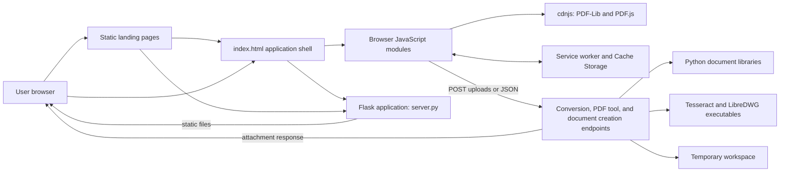
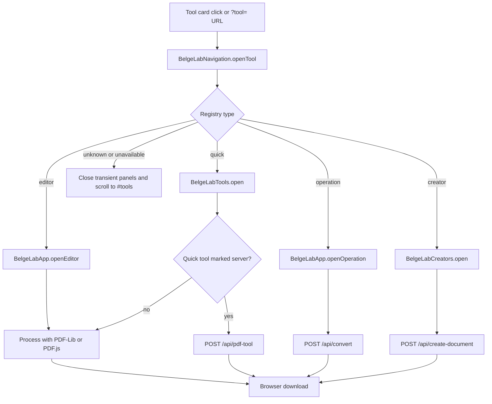
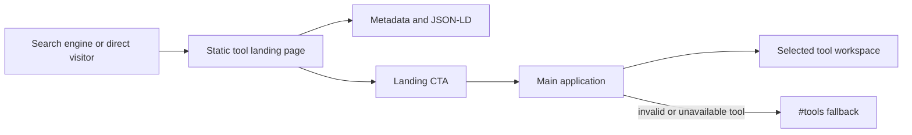
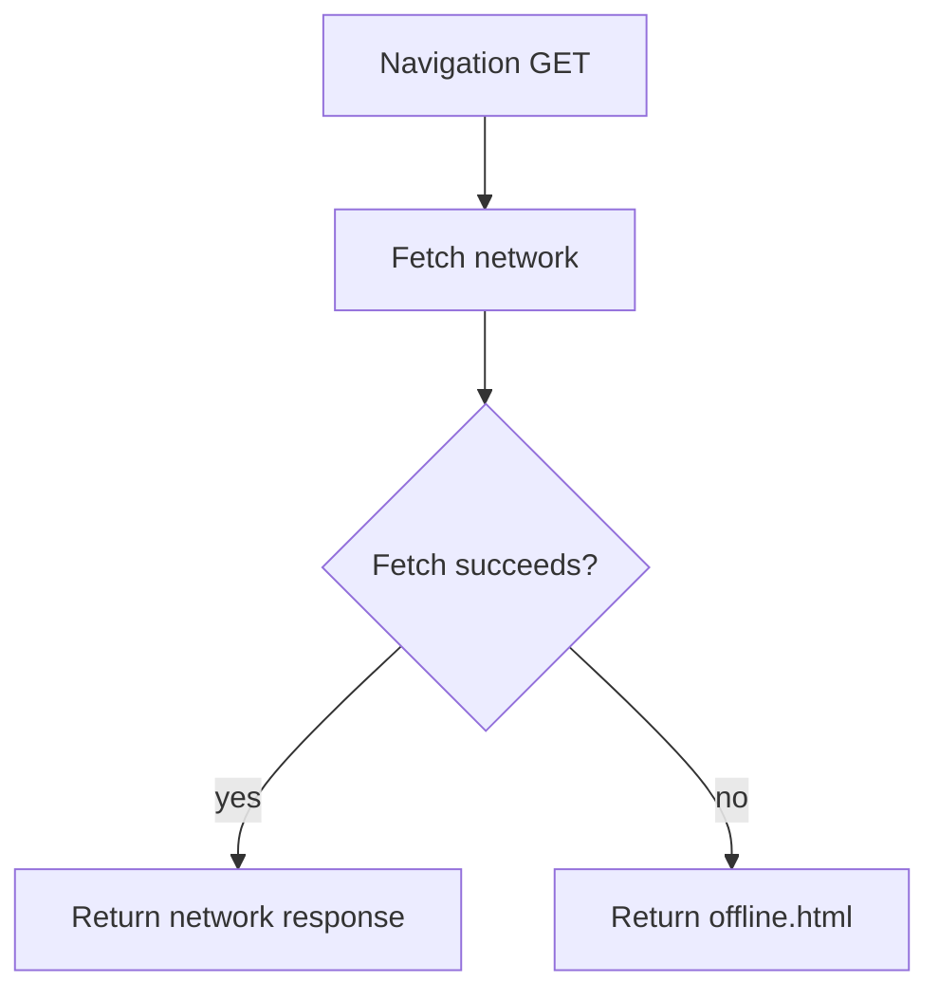
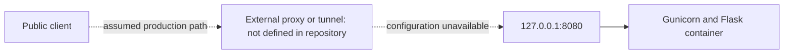

# Architecture

## Purpose

Document the architecture that is present in the current BelgeLab repository so contributors can understand its runtime boundaries, modules, request flows, and deployment model before making major changes.

---

## Scope

Covers the implemented browser application, static landing pages, centralized tool navigation, JavaScript modules, Flask API, service worker, Docker image, Compose service, and the observable reverse-proxy boundary. It does not define coding conventions, test procedures, release policy, production credentials, DNS configuration, or an unimplemented target architecture.

---

## Status

Draft

---

## Last Updated

2026-07-29

---

## Owner

BelgeLab Team

---

## Table of Contents

1. Project Overview
2. High-Level Architecture
3. Directory Structure
4. Application Flow
5. Tool Navigation System
6. Landing Page Architecture
7. JavaScript Modules
8. Service Worker
9. Docker Deployment
10. Cloudflare Tunnel
11. Future Architecture

---

## 1. Project Overview

**Confirmed implementation:** BelgeLab is a Turkish document utility delivered as a server-served static file set plus a browser-side JavaScript application. The same Flask process serves the repository's static assets and exposes document-processing APIs.

The application uses two processing locations:

- Browser-local processing for the PDF editor and most quick tools. These flows use PDF-Lib and PDF.js loaded from cdnjs.
- Server-side processing for document conversion, document creation, and the PDF protect, unlock, repair, and compare tools. These flows upload inputs to Flask endpoints and download the generated response.

There is no frontend framework, package manager, bundler, database, queue, user account system, or separate API service in the current repository. JavaScript is loaded as classic scripts and shares a small set of `window.BelgeLab*` APIs.

The Flask application enforces a 16 MB request limit, per-endpoint in-memory rate limits by default, input-format validation, a 250-page PDF limit, security headers, canonical production redirects, and temporary processing directories for conversion uploads. Generated creator documents are built in memory.

## 2. High-Level Architecture

**Confirmed implementation:** The browser, Flask/Gunicorn process, filesystem assets, Python document libraries, and selected system executables form the complete in-repository runtime.



The diagram shows logical responsibilities, not separate deployed services. `server.py` owns both `FLASK` and `API`. Static files are served from the repository root because Flask is initialized with `static_folder="."` and `static_url_path=""`.

The following external runtime dependencies are confirmed:

- cdnjs hosts PDF-Lib 1.17.1, PDF.js 3.11.174, and the PDF.js worker used by browser-local tools.
- Tesseract provides OCR support in server-side PDF-to-Word flows.
- LibreDWG executables provide DWG conversion paths inside the Docker image.
- Google advertising resources may be loaded by `ads.js` only when configured and allowed by consent.

No persistent application datastore is implemented. Flask-Limiter defaults to `memory://`, although `RATELIMIT_STORAGE_URI` can select another supported backend at runtime.

## 3. Directory Structure

**Confirmed implementation:** The repository is intentionally flat for application and landing assets. The following groups reflect files currently present; they are not generated module boundaries.

```text
/
├── index.html                  Main application shell and tool workspaces
├── app.js                      Main editor, converter, PWA install, and app API
├── tools.js                    Quick PDF tools
├── creators.js                 Word, Excel, and PowerPoint creator UI
├── tool-navigation.js          Central tool-ID registry and URL opening
├── consent.js                  Consent storage and consent UI
├── ads.js                      Consent-gated advertising loader
├── style.css                   Shared application and landing-page styles
├── sw.js                       Service worker
├── manifest.json               PWA manifest
├── offline.html                Offline navigation fallback
├── server.py                   Flask static server and processing API
├── requirements.txt            Python runtime dependencies
├── Dockerfile                  Multi-stage production image
├── docker-compose.yml          Single-service local/host deployment definition
├── tessdata/
│   └── tur.traineddata         Turkish OCR language data in the repository
├── docs/                       Engineering handbook drafts
├── *tool and guide pages*.html Static SEO, legal, guide, and informational pages
├── sitemap.xml                 Search-engine URL inventory
├── robots.txt                  Crawler rules
└── icons and favicons          PWA and browser assets
```

The landing pages do not use a literal `*-landing.html` filename suffix. They use descriptive Turkish filenames such as `pdf-word.html`, `pdf-kucult.html`, `dwg-pdf.html`, and `word-olustur.html`.

`server.py` blocks direct requests to selected operational files (`server.py`, `requirements.txt`, `Dockerfile`, `docker-compose.yml`, and `.dockerignore`) and to `/tessdata/`. Other static files under the application root are within Flask's static-serving boundary unless excluded by Flask/Werkzeug behavior.

## 4. Application Flow

### 4.1 Page load

**Confirmed implementation:** A request to `/` reaches the explicit Flask `index()` route and returns `index.html`. Other HTML and asset requests are served through Flask's root static route. On the production host, requests for `www.belgelab.com.tr` or insecure `belgelab.com.tr` are redirected with HTTP 308 to `https://belgelab.com.tr`.

`index.html` loads PDF-Lib and PDF.js first, followed by `app.js`, `tools.js`, `creators.js`, `tool-navigation.js`, `consent.js`, and `ads.js`. This order creates the module APIs before URL-based navigation is evaluated.

### 4.2 Tool execution



Browser-local quick tools are compression, PDF-to-JPG, JPG-to-PDF, signature text, watermark, rotation, page numbering, crop, and PDF-to-Markdown. The main PDF editor also merges, reorders, rotates, adds, deletes, compresses, previews, and downloads in the browser.

Server quick tools are unlock, protect, repair, and compare. `/api/convert` handles PDF/DOCX/XLSX/PPTX/DWG conversion operations. `/api/create-document` accepts JSON for Word, Excel, or PowerPoint output.

Conversion uploads are written inside `TemporaryDirectory` and read back before the directory closes. PDF quick-tool uploads are processed from request memory. Creator output is built in `BytesIO`. There is no persisted job record or output store.

### 4.3 API behavior

**Confirmed implementation:** API responses are download attachments or Turkish JSON errors. `/api/convert`, `/api/pdf-tool`, and `/api/create-document` are limited to 10, 15, and 20 requests per minute respectively. CORS is configured only for `/api/*`, for `POST` and `OPTIONS`, using `ALLOWED_ORIGINS` or the built-in origin list.

`ProxyFix` trusts one forwarded hop for the client address, scheme, and host. This is important to canonical redirects and rate-limit identity when the application is behind a reverse proxy.

## 5. Tool Navigation System

**Confirmed implementation:** `tool-navigation.js` is an immediately invoked script containing a private registry. Public navigation is exposed only as:

```text
window.BelgeLabNavigation.openTool(toolId)
```

Registry entries map stable kebab-case tool IDs to one of four adapters:

| Registry type | Target API | Responsibility |
|---|---|---|
| `editor` | `window.BelgeLabApp.openEditor()` | Scroll to the main PDF editor |
| `operation` | `window.BelgeLabApp.openOperation(value)` | Select a conversion and scroll to the converter |
| `quick` | `window.BelgeLabTools.open(value)` | Configure and reveal the quick-tool panel |
| `creator` | `window.BelgeLabCreators.open(value)` | Configure and reveal a document creator workspace |

The script reads the first `tool` query parameter with `URLSearchParams` after defining the global API. A known ID opens its workspace; an unknown ID or unavailable target closes transient quick/creator panels and scrolls to `#tools` without throwing.

Tool cards in `index.html` carry `data-tool-id`. Existing card listeners in `app.js`, `tools.js`, and `creators.js` delegate to the central navigation API when it exists, then retain their older local fallback path.

Before opening a target, navigation closes quick and creator workspaces. After a successful open, it schedules focus for the first enabled form control or suitable action button using `requestAnimationFrame`.

`tool-navigation.js` is tracked in Git and referenced by both `index.html` and the `sw.js` asset list.

## 6. Landing Page Architecture

**Confirmed implementation:** Tool, guide, legal, and informational landing pages are static HTML files served by Flask. Tool landing pages share `style.css` and generally contain:

- unique title and meta description;
- canonical URL;
- Open Graph and Twitter metadata;
- one visible `h1` hero heading;
- explanatory content and internal links;
- WebPage and, where applicable, FAQPage JSON-LD;
- a CTA back to the main application;
- `consent.js` and `ads.js` at the end of the body.

There is no template engine, static-site generator, or build step in the repository. Repeated landing markup and structured data are stored independently in each HTML file.



Tool-specific hero and final CTAs use the `/?tool=<tool-id>` contract and open the mapped workspace through the central registry. General “Araçlara dön” navigation links may still use `/#tools` because they target the tool list rather than one specific tool.

## 7. JavaScript Modules

The files are classic scripts rather than ECMAScript modules. Their boundaries are conventions and globals, not import/export relationships.

| File | Confirmed responsibilities | Public or shared interface |
|---|---|---|
| `app.js` | Main PDF editor, category filtering, conversion selection/upload/download, conversion API calls, PWA installation UI, service-worker registration | `window.BelgeLabApp.openOperation`, `window.BelgeLabApp.openEditor` |
| `tools.js` | Quick-tool configuration, local PDF/image processing, crop UI, server PDF-tool calls, downloads | `window.BelgeLabTools.open`, `window.BelgeLabTools.close` |
| `creators.js` | Word editor, Excel grid, PowerPoint slide state, creator panel, JSON submission and downloads | `window.BelgeLabCreators.open`, `window.BelgeLabCreators.close` |
| `tool-navigation.js` | Stable tool-ID registry, URL parsing, cross-module dispatch, fallback, focus management | `window.BelgeLabNavigation.openTool` |
| `consent.js` | Versioned consent state in `localStorage`, consent banner/preferences UI, consent events | `belgelab:consent` browser event |
| `ads.js` | Consent-aware ad script and slot creation | Listens for `belgelab:consent` |
| `sw.js` | Offline asset cache and network handling in a worker context | Service-worker lifecycle and fetch events |

`app.js` and `tools.js` depend on the CDN-provided `window.PDFLib` and `window.pdfjsLib`. The PDF.js worker URL is also configured to cdnjs. The creator and server-tool modules use same-origin `fetch` calls.

`server.py` is the backend module. In addition to routes, it contains validation, PDF text extraction, OCR, Office generation, spreadsheet layout rendering, LibreOffice detection, DWG conversion, safe expression evaluation for spreadsheet formulas, and attachment-response helpers. These responsibilities are implemented in one file rather than separated into packages or service classes.

## 8. Service Worker

**Confirmed implementation:** `app.js` registers `/sw.js` when service workers are supported. The current cache is `belgelab-cache-v35`.

During installation, the worker pre-caches the offline page and a fixed allowlist of safe static scripts, styles, and PWA assets. It does not pre-cache `/`, `/index.html`, landing pages, or informational HTML pages. `skipWaiting()` activates the new worker promptly. Activation deletes every cache whose name differs from the current cache and then calls `clients.claim()`, removing application-shell entries left by older cache versions.

Navigation requests use the network and fall back only to the cached Turkish `offline.html` page when the network fails:



Requests whose paths exactly match the static allowlist use cache-first behavior. Other same-origin GET requests, all non-GET requests, and cross-origin requests are not intercepted or stored. API uploads therefore go directly to the network, while HTML and dynamic responses never enter the runtime cache.

PDF-Lib, PDF.js, and the PDF.js worker remain cross-origin runtime dependencies and are not part of `STATIC_ASSETS`. They are fetched only while the online application is running; the offline fallback does not expose the tool interface.

The Flask response hook sends `Clear-Site-Data: "cache"` for API responses and no-cache headers for selected core assets. Whether browsers clear Cache Storage in response to the API header is browser-dependent; the repository contains no compatibility handling or documented rationale for the interaction with the PWA cache.

## 9. Docker Deployment

**Confirmed implementation:** The Dockerfile is multi-stage.

1. `debian:trixie-slim` downloads a pinned LibreDWG 0.14 archive, verifies its SHA-256 checksum, builds static command-line programs, and exports `dwg2SVG` and `dwg2dxf`.
2. `python:3.12-slim` installs Tesseract with Turkish language data, installs Python requirements, copies the repository, copies the LibreDWG tools, and runs as UID 10001.

Gunicorn binds to `0.0.0.0:${PORT}` with two workers, two threads per worker, a 180-second timeout, and stdout/stderr logging. The image exposes port 8080 and checks `/health` every 30 seconds.

Compose defines one `belgelab` service:

- builds the local Dockerfile;
- publishes container port 8080 only on host loopback at `127.0.0.1:8080`;
- uses a 256 MB `tmpfs` at `/tmp/belgelab` with `noexec`, `nosuid`, and `nodev`;
- drops all Linux capabilities and prevents privilege escalation;
- limits PIDs, memory, and CPU;
- rotates JSON logs;
- restarts unless stopped;
- passes an optional `DWG_TO_PDF_COMMAND`.

The loopback-only port implies that an additional host-side reverse proxy or tunnel is required for public access. The identity and configuration of that component are not defined in this repository.

**Confirmed fallback behavior:** The runtime image does not install LibreOffice. `server.py` attempts LibreOffice for XLSX-to-PDF when available, then uses its own ReportLab-based spreadsheet layout renderer. Other Office-to-PDF paths are implemented through text extraction and ReportLab rather than full desktop-Office rendering.

## 10. Cloudflare Tunnel

**Confirmed repository evidence:** There is no Cloudflare Tunnel configuration, `cloudflared` service, tunnel identifier, credentials reference, ingress rule, installation script, or deployment command in the current repository. The only project instruction is that Cloudflare Tunnel settings must not be changed without explicit authorization.

The observable integration boundary is:

- Compose exposes BelgeLab on host loopback port 8080.
- Flask applies `ProxyFix` for one forwarded hop.
- Flask canonicalizes the public host to `https://belgelab.com.tr`.



The dashed connections are **assumptions**, not confirmed implementation. Production tunnel ownership, TLS termination, hostname routing, forwarded-header behavior, access policy, availability monitoring, and credential storage remain open questions.

## 11. Future Architecture

No target architecture or approved migration plan is implemented in this repository. The items below are documentation needs and observed decision points, not commitments or existing components:

1. Keep landing-page CTA IDs, card `data-tool-id` values, and the central registry synchronized as tools are added or renamed.
2. Preserve the online-only application-shell decision when evolving the PWA: offline navigation should continue to show only `offline.html`, not a cached tool interface.
3. Document the production reverse proxy or Cloudflare Tunnel outside the repository if credentials prevent committing its configuration.
4. Decide whether the single-file Flask backend should remain the intended boundary as route and conversion responsibilities grow.
5. Define whether rate limiting must use shared storage when multiple Gunicorn workers or multiple application instances are used.
6. Clarify which root files are intentionally public through Flask's root static folder and maintain an explicit deny or allow policy.
7. Record significant decisions as ADRs before introducing databases, queues, background jobs, authentication, or additional services. None of those components exists today.

### Confirmed implementation versus assumptions

All statements labeled **Confirmed implementation** or **Confirmed repository evidence** are derived from files in the current checked-out repository. The only assumed production path is the dashed external proxy/tunnel flow in the Cloudflare section. No claim is made here about infrastructure details that are not represented in the repository.

---

## Notes

This document describes the current checked-out repository architecture and remains a draft. Runtime production infrastructure outside the repository is documented only where repository evidence exists; other details are explicitly labeled as assumptions or open questions.
